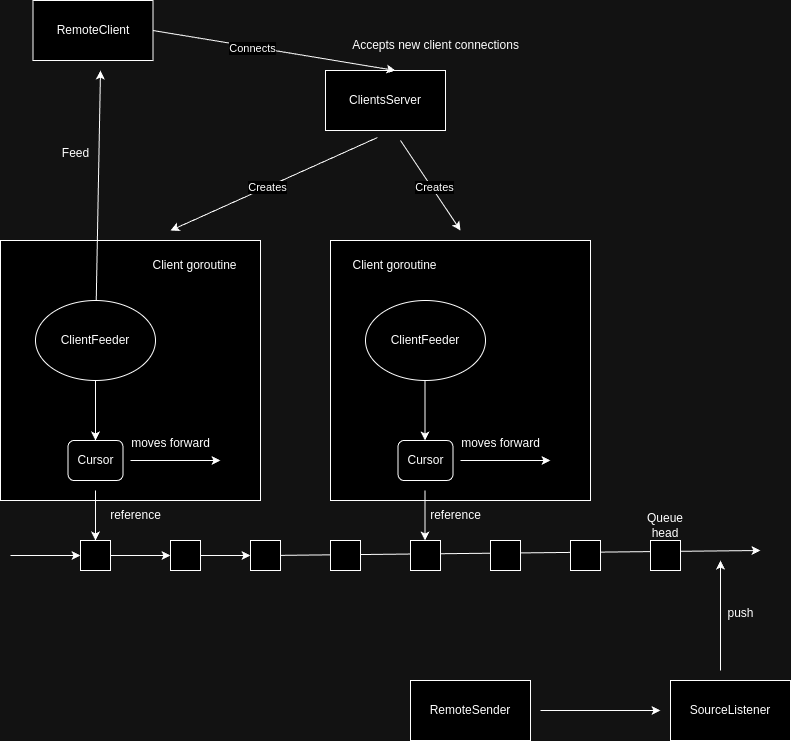

# Multiplexer

This multiplexer server receives messages via SSH from a remote sender and forwards them to client subscribers. The multiplexer takes each message from the remote sender and places them in a queue. Each subscribed client has a dedicated goroutine (called a client goroutine) that iterates through the queue and sends each message to the client.

## How it works

The multiplexer uses a queue, implemented as a linked list, where it is possible only to push new messages into this queue. Additionally, it is possible to obtain a Cursor for this queue. When a new Cursor is obtained, it points to the head of the queue, which is the most recently added element. The Cursor can be thought of as a representation of the tail of the queue. There can be multiple Cursors, one for each subscriber. The client goroutine will move its Cursor forward, retrieve the message at each position, and send that message to the client. Cursors move forward independently and stop when they reach the head of the queue, waiting for new nodes/messages to become available in the queue.

When the last Cursor leaves its current node and moves to the next one, the previous node should become eligible for garbage collection. The methods of using this Queue heavily rely on garbage collection which, as observed during testing, is not necessarily memory efficient due to the significant pressure on garbage collection. If it does not deallocate resources quickly enough, memory usage can consistently increase.

## Assumptions

When a new client connects, a new Cursor is created for it, pointing to the head of the Queue. For performance reasons, the Queue implementation is not synchronized.

- Since the head of the Queue is accessed concurrently by the SourceListener and the new ClientFeeder, the Cursor obtained by the ClientFeeder might not be the most recent message from the queue, but this is not critical.
- Also, the ClientFeeder attempts to concurrently access the next new element in the queue by checking `Cursor.HasNext()`. I assume there is no race condition since the SourceListener is the only one who adds a new element, and `.HasNext()` will return true at some point. Meanwhile, the ClientFeeder will just use `.HasNext()` and then read the message.
